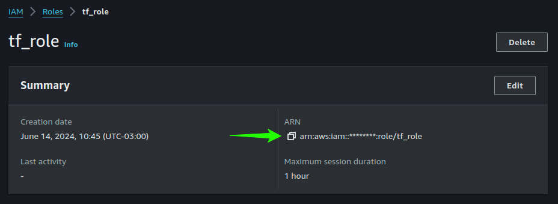

# CD Pipeline deployment of devops-create-image-nest-api project

## Prerequisites

**AWS CLI**

- You need an AWS account
- You need to install AWS CLI
https://docs.aws.amazon.com/cli/latest/userguide/getting-started-install.html

**AWS SSO**

```bash
aws sso configure
aws sso login --profile {$profileName}
```

## Sensitive data

For the `thumbprint` run the command below

```bash
echo | openssl s_client -servername token.actions.githubusercontent.com -connect token.actions.githubusercontent.com:443 2>/dev/null | openssl x509 -fingerprint -noout | sed 's/SHA1 Fingerprint=//' | tr -d ':'
```

```bash
cp secret.tfvars.sample secret.tfvars
```

Edit `secret.tfvars` and add your Github repository

```hcl
aws_account_id  = "{AWS Account ID}"
thumbprint      = "{SHA1 Fingerprint}"
gh_iac_repo     = "repo:{username}/{repo}:ref:refs/heads/{branch}"
gh_app_repo     = "repo:{username}/{repo}:ref:refs/heads/{branch}"
```

Run the command to check if everything is ok

```bash
terraform plan -var-file=secret.tfvars
```

These steps are only for running Terraform locally.

We also need to store these variables in Github Secrets.
You can create them in the Github UI: 
`https://github.com/{user}/{repo}/settings/secrets/actions`


## Creating the role for the Terraform CLI on AWS

Now we need to apply the changes locally, and get the ARN of the role that we will use in the next step.

```bash
terraform apply -var-file=secret.tfvars
```

Type `yes` to apply the changes.

Go to your AWS console and open the IAM console.
On Roles, click in the new role that was created `tf_role` and copy the ARN.



Now we need to create a Github Secret with the ARN of the role, and the name `ARN_TF_ROLE`.
You can follow the same steps as in the previous section.

## Deployment

```bash
terraform init
terraform plan
terraform apply
```